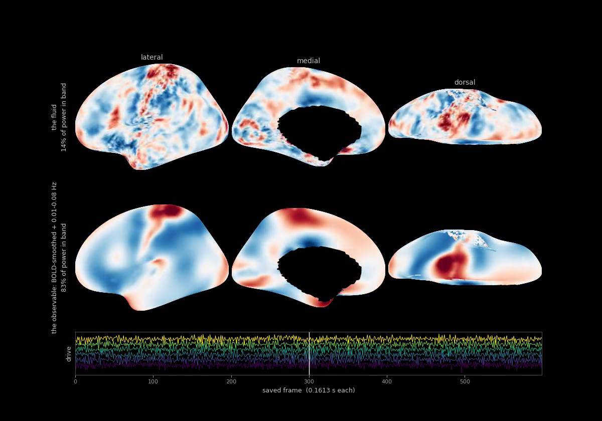

# CCFD

Rotating shallow-water flow on a cortical surface, driven at named Glasser
parcels, compared against resting-state fMRI.

The surface is the left fsaverage5 inflated mesh with the medial wall cut out
(9,374 vertices). Fluid depth `h` and edge-normal velocity `u` evolve under the
linear rotating shallow-water equations, discretised with a C-grid / DEC scheme
whose Coriolis operator is energy-neutral by construction.

The input is **solved for, not searched**. Because the medium is linear, the
field covariance depends on the drive only through its cross-spectral density
`S(f)`, so matching functional connectivity is a convex problem over one
Hermitian PSD matrix per frequency — it has an optimum instead of a plateau.
The pipeline is: impulse response per driven piece → `H(f)` by FFT → solve
`max corr(sum_f H S H^H, target)` over `S(f) >= 0` → draw a drive with that
cross-spectrum → simulate → score.

Scoring is against the 99-subject NKI group FC on fsaverage5, double-centred,
by Spearman over a fixed 2M edge sample. A solve correlation is not a score:
every candidate is realised and simulated before any number is quoted.

## What it looks like

[](docs/nonlinear_pair.mp4)

The clip is [`docs/nonlinear_pair.mp4`](docs/nonlinear_pair.mp4) — 30 s at 20 fps, 600
frames of a 3,578-frame realisation, depth `h` on the left fsaverage5 inflated surface,
lateral / medial / dorsal. **Top row is the fluid itself**: no BOLD kernel, no passband,
nothing applied. **Bottom row is the observable** — the same realisation BOLD-smoothed and
then bandpassed to 0.01–0.08 Hz, which is what the model is scored on and what a scanner
would report. Same drive, same medium, same frames; only the observable differs. Colour
scales are per row and printed, because the observable is 0.29x the fluid's amplitude and
a shared scale would leave the bottom row nearly blank.

The fluid carries **14.2%** of its power in the 0.01–0.08 Hz band the observable keeps.

This is a rotating, advecting, nonlinear medium — `(H + h)` in the depth update,
momentum advection in vector-invariant form, and a 113 s inertial period against a 25 s
decay. It is warm-started from the convex solve in the same medium and fitted by gradient
descent through the simulation, which is what a nonlinearity requires: there is no `H` to
factorise, so the cross-spectrum is no longer a convex problem. 200 iterations, converged
(the last 25 gained 0.0001), no bed strikes. Scored **+0.6818 ± 0.0041** over 2,308 s,
against the linear solve's **+0.6799 ± 0.0035** in the same medium.

```bash
python fit/best_fit.py --oversample 4 --decay-s 25 --spread-mm-s 1.5 --impulse-decays 7 \
  --bandpass 0.01,0.08 --pad 4096 --nfreq 192 --bold-smooth --regions hybrid \
  --hybrid-file results/xspec_asc_first_area_100.npz --split 50 --maps-scale 1 \
  --map-clip iqr --seconds 2308 --iters 400 --draws 2 --val-vert 0 --tag grclip100_nolag
python fit/torch_fit.py --ref grclip100_nolag --init warm --seconds 577 --iters 200 \
  --coef-lim 0.45 --nl-flux 1 --nl-adv 1 --ld 100 --amp 3e-3 --tag nl100_ld100_200
python fit/render_fit.py --tag nl100_ld100_200 --ref grclip100_nolag
python viz/render_bandpass.py --tag nl100_ld100_200v \
  --raw-npy results/frames_nl100_ld100_200v_raw.npy --start 200 --n 600 --save 4
```

### The linear fit it starts from

The nonlinear run above is warm-started from a convex solve in the same medium, which
scores **+0.6799 ± 0.0035** over the same 2,308 s. `docs/bandpass_pair.mp4` is the older
pair figure, and [`docs/best_field.mp4`](docs/best_field.mp4) is a single-row surface clip
of `pr_taper` — a different basis and clock, 47 subcortically driven pieces over 8,542 mm²
at 6 mm/s and a 9.03 s decay, scoring **+0.7204 ± 0.0009**:

```bash
python fit/best_fit.py --oversample 4 --decay-s 9.03 --spread-mm-s 6 --bold-smooth \
  --pad 4096 --impulse-frames 224 --iters 400 --val-vert 0 --draws 2 \
  --regions subcortical --split 40 --profile taper
python viz/render_frames.py --tag pr_taper --start 200 --n 600 --save 16 --fps 20
```

`RUNS.md` indexes every solve and fit on disk with its parameters and its score.

## Layout

The tree is five folders and no package: there is no install step and every script is run
as a plain file from the repository root, `python fit/best_fit.py --tag ...`, importing
what it needs by plain name. Each folder carries a copy of `_path.py`, which every runnable
file imports first — Python puts only the script's own directory on `sys.path`, so without
it a script in `analysis/` could not find `fit/xspec.py`.

| folder | what lives there |
|---|---|
| `core/` | the mesh, the medium, the clock and the observable — `paths`, `mesh_cache`, `surf_ops`, `fluid`, `swe_rot`, `units`, `timescale`, `bandpass`, `ladder`, `regimes` |
| `targets/` | reading scans and building the FC targets they are scored against — `rbc`, `fc_score`, `fc_group_nki`, `fc_group_rbc`, `fc_vertexwise`, `reliability`, `holdout`, `lagged`, `checkerboard` |
| `fit/` | the input model and the convex solve — `xspec`, `best_fit`, `bo_step`, `subparcels`, `connectome`, `segments`, `family` |
| `analysis/` | diagnostics and experiments — `diag_*`, `band_*`, `interference`, `zones`, `checkerboard_model`, `checkerboard_modulation`, `onoff_*`, `task_inputs` |
| `viz/` | `render_*`, `plot_*`, `surface_plots` |

`data/` holds the datasets and `results/` everything written; both are addressed through
`core/paths.py`, which derives them from the repository root rather than from a working
directory.

| file | what it does |
|---|---|
| `core/paths.py` | every path, derived from the repo location |
| `core/provenance.py` | argv, the full namespace and the commit, saved into every checkpoint |
| `analysis/runs.py` | regenerate `RUNS.md`, the index of every solve and fit on disk |
| `core/surf_ops.py` | surface loading, primal/dual (DEC) operators |
| `core/intrinsic_delaunay.py` | metric repair; without it the scheme blows up in ~200 steps |
| `core/mesh_cache.py` | builds and caches the `Cortex` object: mesh + atlas + repaired metric |
| `core/swe_rot.py` | the solver: `RotSWE.step`, plus the absorbing rim sponge |
| `core/fluid.py` | the medium: speed and damping graded by cortical maps, integration |
| **the fit** | |
| `fit/best_fit.py` | reproduce the current fit; the entry point |
| `fit/xspec.py` | transfer function, the convex solve, realisation, scoring |
| `fit/subparcels.py` | equal-area splitting; which parcels are driven |
| `fit/bo_step.py` | Bayesian optimisation over the medium, in per-step units |
| `fit/coalitions.py` | read the solved `S(f)` back as amplitudes and time offsets |
| **targets and controls** | |
| `targets/fc_vertexwise.py` | vertexwise FC from MSC surface data |
| `targets/fc_group_nki.py` | the NKI group target (99 usable subjects) |
| `targets/fc_centre.py` | double-centring: the linear analogue of global signal regression |
| `targets/fc_score.py` | `FCTarget`: alignment, edge sample, Spearman score |
| `targets/fc_moran.py` | spatial autocorrelation match, as a diagnostic |
| `fit/family.py` | the family of inputs consistent with the target, not just the argmax |
| `targets/fc_states.py` | windowed-FC states, occupancy, dwell, transitions |
| `targets/reliability.py` | split-half reliability of the target, and the ceiling it implies |
| `targets/holdout.py` | solve on one half of the subjects, score on the other |
| `analysis/reach.py` | can this fluid produce the target's patterns at all? |
| `analysis/diag_maps.py` | where the fit fails, drawn on the surface |
| **input, by hand** | |
| `fit/input2.py` | input as K regions with timecourses supplied directly |
| `fit/input_model.py` | input as K regions driven through r shared latent factors |
| `core/ladder.py` | a nested family of input processes; parcel geodesics |
| `core/run_ou.py` | Ornstein-Uhlenbeck drive |
| `core/run2.py` | minimal script: regions + your own timecourses + mp4 |
| `core/play_fluid.py` | hand-tune the medium with the input held fixed |
| **pictures** | |
| `viz/render_frames.py` | video of a field a `best_fit` run already wrote to disk |
| `viz/surface_plots.py` | the movie / latent-map / medium-map helpers |
| `viz/render_regimes.py` | surface projections, videos of swept regimes |
| `viz/plot_fc_map.py`, `core/cortical_maps.py` | surface maps and the cortical map stack |
| `targets/get_msc.py` | reads MSC CIFTI-1 files (nibabel refuses these directly) |

## Running

```bash
python core/mesh_cache.py                          # build and cache the mesh
python targets/fc_group_nki.py                        # build the group FC target
python fit/best_fit.py --frames 4480 --draws 3    # solve, realise, score
python viz/render_frames.py --tag best --n 500    # watch what it produced
```

`best_fit.py --regions {sensory,spread,sensory+dmn,dmn}` selects which parcels
are driven. `RUNS.md` indexes every solve and fit on disk — parameters, paths
and, for runs written after `core/provenance.py`, the command line — and is
regenerated by `python analysis/runs.py`.

`core/run2.py` is the smaller entry point: set `REGIONS`, build an `(nsteps, K)`
array of timecourses, run, write an mp4.

Two things about the drive worth knowing, since neither is obvious from the code:

- **Timecourses are a source, not a depth.** `h += Aser[n] @ P` adds to depth
  every step, so the field follows the running integral of what you supply. A
  series whose integral never crosses zero (a sine started at zero) leaves that
  region one-signed for the whole run.
- **Regions are weighted by area.** Tapers peak at 1 per vertex regardless of
  parcel size, so a large parcel injects proportionally more. `drive.w` holds
  the area integral per region; `A -= np.outer(A @ w, w)/(w @ w)` removes any
  net injection. `input_model.NetworkDrive` does this internally as its
  `balance="spatial"` mode; `input2.RegionDrive` leaves it to the caller.

## Data

Included: the HCP-MMP1 left-hemisphere annotation (`data/annot`) and fsaverage5
/ fsaverage6 inflated left surfaces (`data/surf`). Both carry their upstream
licences.

Not included: MSC subject-01 resting-state scans (~2 GB, above GitHub's file
size limit). Only the MSC path in `targets/fc_vertexwise.py` needs them; the NKI group
target that everything is now fitted to is fetched by nilearn. Get them from [OpenNeuro ds000224](https://openneuro.org/datasets/ds000224),
`derivatives/surface_pipeline`, and put the `*_rest.dtseries.nii` and
`*_tmask.txt` files in `data/msc/`.

Caches under `data/cache/` and output under `results/` are regenerated on
demand and are not tracked.

## Requirements

numpy, scipy, scikit-learn, nibabel, nilearn, matplotlib, hcp_utils,
scikit-optimize (for `fit/bo_step.py`). ffmpeg for video.
